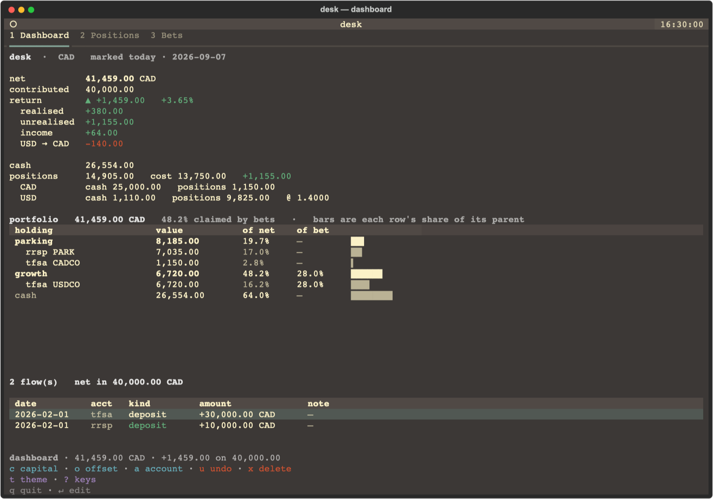
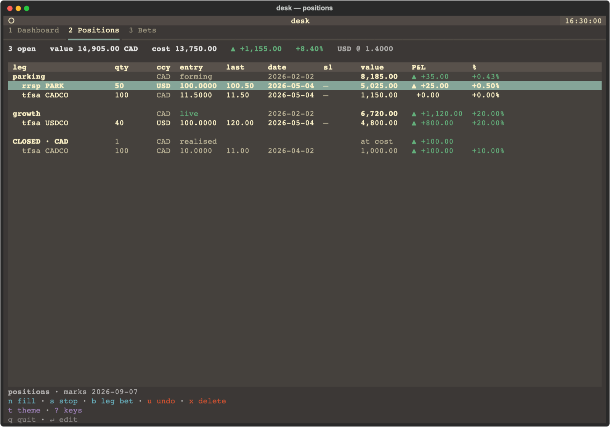
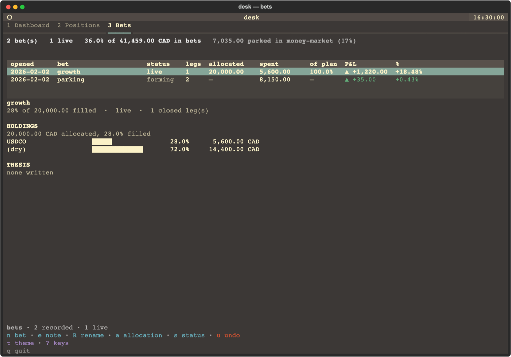

# trading-desk

A terminal bookkeeping tool for your own trading: a SQLite book, a Textual TUI over it, and
a checker that refuses to let the record contradict itself.



<details>
<summary>positions and bets</summary>





</details>

Every figure above is invented. The screenshots are rendered by `tools/screenshots.py` from
the same synthetic book the test suite runs against, so they cannot publish a real position
and cannot drift from a state the tests already cover — re-run it after any change that
moves a column.

**This repo is the TOOL. Neither your record nor your writing is in it.**

Data is data and code is code. A repo holding both is one you cannot share, cannot
publish, and cannot check out twice — and a trading thesis is neither, so it gets a third
place rather than being wedged into one of the first two.

So there are three things and they live in three places:

| | what | where |
|---|---|---|
| **the tool** | this repo — schema, TUI, checks | git, shareable, no positions in it |
| **the book** | accounts, fills, flows, bets | `$TRADING_DESK_BOOK`, wherever you back up |
| **the writing** | theses, observations, patterns | its own repo, in Obsidian. **This tool never touches it** |

## What this is, and what it is not

**It is a bookkeeping tool.** It records what was done, and nothing is built on top of
the record yet.

It records, it shows, and it refuses to state what it does not know. **It enforces
nothing.** No risk rules, no limits, no verdicts on a trade: it links bets to positions and
prints what is there.

That is a conclusion about mechanics rather than a preference. The broker is somewhere else
and this book is read afterwards, so nothing here could ever stop a trade — which made
"LOSS LIMIT BREACHED, close the portfolio and step away" a sentence a text file said to
someone who had already decided. A wall that cannot hold is a wall in name only, and
calling it one made every figure around it read as permission. A limit you hold yourself to
needs no column; one you do not is not made real by storing it.

What survives are **integrity** constraints, which are a different thing: a closed trade
cannot hold shares, an audit log cannot be edited, a fill cannot take a position short.
Those keep the record from stating a contradiction. They do not judge the trading.

`desk/schema.sql` is the record's integrity as constraints: 16 tables, 22 triggers,
2 views and 9 indexes, and the comment on each one says which failure produced it. Whatever
discipline you trade by stays where you write, not in here — the tool has no opinion on it
and no way to check it.

Named a desk rather than a hub because that is the actual noun: a desk is where a
book, its views and its risk limits live, and it allocates to pods — which is how
bets work here.

```
book/
├── schema.sql                 THE SCHEMA. Source of truth, and it is CODE
├── migrate.py                 --new to create a book, --check to detect drift
├── check.py                   assert the invariants; exits non-zero if wrong
└── prices.py                  pull closes and FX
desk/
├── config.py                  WHERE THE BOOK IS. $TRADING_DESK_BOOK
├── book.py                    all the arithmetic, no Textual
├── parse.py                   the one-line grammar
└── tui/                       four tabs: dashboard, positions, capital, bets
tests/
├── test_desk.py               the CODE, against a synthetic book. Needs no data
├── test_book.py               the RECORD. Skips when there is none
├── test_schema.py             schema.sql and migrate.py, incl. the drift test
└── seed.py                    the synthetic book, built from schema.sql
```

## Install

```sh
pip install trading-desk        # or: uv tool install trading-desk
desk                            # it offers to create a book, and says where
```

Four commands are installed. `desk` is the whole tool; the next two exist because a book
has to come from somewhere and has to be checkable, and `desk-mcp` needs the optional extra
below before it will run:

| | |
|---|---|
| `desk` | the TUI. Everything is done in here |
| `desk-migrate --new` | create a book. `--check` compares one against the schema, `--upgrade` rebuilds it at the current version carrying every row |
| `desk-check` | the invariants, then an attribution panel. `--quiet` for invariants only; exits non-zero if one fails |

## Handing the book to a model

```sh
pip install 'trading-desk[mcp]'
desk-mcp                        # speaks MCP over stdio
```

`desk-mcp` exposes the book to an MCP client — positions, bets, closed round trips, derived
net worth, the invariants, and the attribution panel. The task it exists for is
reconciliation: give a model your broker statement, let it compare the two, and have it tell
you what disagrees.

**It is read-only, and that is the design rather than a first step.** Everything it exposes
is *derived*, so being wrong about it costs a confusing answer. A write would be different in
kind: an invented fill is a fabricated trade, and unlike a wrong balance nothing downstream
contradicts it — the book would simply believe it, which is the confident-wrong-figure failure
every rule here exists to prevent. So the model reads and reports; a human records.

Read-only **by construction**: the connection is opened `mode=ro`, so SQLite refuses a write
and a bug in a tool raises instead of corrupting. The tools also carry `read_only_hint` for
the client's benefit — one of those can be forgotten in review and the other cannot, and
there is a test for each.

The server's instructions tell the model the two rules it would otherwise break: that `null`
means **not recorded** and never zero, and that rows are in their own currency while only
totals are in the home currency. A reader that hands figures to something eager to be helpful
is exactly where those get undone.

`mcp` is an optional extra, so a plain `pip install trading-desk` still pulls in nothing but
Textual.

**The first run offers to create a book**, printing the path it would use and what chose
that path before it writes anything — four things can decide it, and a mistyped
`$TRADING_DESK_BOOK` would otherwise make a second empty book in silence. Answer `n` and set
the variable if the path is not the one you want. `desk-migrate --new` does the same thing
without the question.

A fresh book has NO ACCOUNTS and every write lands in one, so open a sleeve first: `a` on
the dashboard, then `tfsa default`.

From a checkout instead:

```sh
uv sync
uv run desk-migrate --new
uv run desk
```

**An unknown ticker registers itself.** Type a fill for a symbol the book has never seen
and it is looked up at the price source, which supplies the currency, the type, the name
and the quote symbol — so `ZGLD` becomes `ZGLD.TO` without your having to know that.
The registry is still a wall against typos; it is just a better one, because
`NOSUCHTICKER` does not exist anywhere rather than merely not existing here.

**There is no instrument key**, and the one there was is gone. Nobody should have to
register a ticker before recording that they bought it. A currency to translate with and a
symbol to fetch by are facts the TOOL needs, and not one of them is a decision about
trading — so the tool fetches them itself and stops asking.

The one case a lookup genuinely cannot settle is an **ambiguous** ticker, which is not rare
— `CBIL` is *Corgi 3-12 Month T-Bill* in New York and *Global X 0-3 Month T-Bill* in
Toronto, and `INTC` and `TQQQ` have the same shape. So the fill prompt becomes a `listing`
prompt: the toast names which security each candidate is, `tab` **cycles** them, and enter
replays the fill you already typed. It cycles rather than completes because the candidates
share a prefix by construction, so prefix completion would insert nothing and read as a
dead key. Nothing is written until you pick, and escaping writes nothing at all.

Leverage is the case that got dropped instead. It is not in the metadata — Yahoo calls
SOXL a plain ETF — and it was only ever used to warn, which is a rule, and there are no
rules left.

An account is just a NAME. It carried a `kind` from a Canadian tax taxonomy and a single
`currency` until v11, and both went — nothing read the kind, and one currency per sleeve
is false when a TFSA holds CAD and USD at once. So `a` takes an id, an optional `~name`,
and the bare word `default`.

**No configuration is needed.** The book defaults to
`~/Documents/trading-desk/hub.db` and `--new` creates the folder. Nothing goes in your
shell profile and nothing goes in this repo — the shape is borrowed from `daylogs`,
which defaults to `~/Documents/daylogs/` for the same reason.

To put the book somewhere else:

| | |
|---|---|
| `$TRADING_DESK_HOME` | move the whole data root |
| `book = "..."` in `<root>/config.toml` | move just the book. **Config lives with the DATA**, never in this repo |
| `$TRADING_DESK_BOOK` | one book, absolute. Beats the config file, so `TRADING_DESK_BOOK=/tmp/x desk` is a safe one-off |

The same `config.toml` holds the **profile** — your name and your home currency:

```toml
name = "Your Name"
home_currency = "CAD"      # CAD or USD; anything else falls back to CAD and says so
theme = "nord"             # any Textual built-in; an unknown name falls back, silently
```

`theme` is the one key the app itself writes: `t` opens a picker you arrow through with the
interface live underneath, and `enter` saves your choice here. It is a config key as well as a
key binding because *"gruvbox"* versus *"nord"* is unguessable from a file — and a wrong guess
otherwise costs a restart to see.

Both have defaults (`desk` and `CAD`), so an absent file is a supported state. The home
currency is what every figure on the dashboard is quoted in; changing it re-denominates
the page and rewrites nothing, because cash is stored per currency and only the current
balance is ever translated.

`?` names which book is in use and **why** that one — four things can decide the
path, and when a figure looks wrong the first question is which book produced it.

**Use the project's environment, not your system Python.** The TUI needs Textual,
which is declared in `pyproject.toml` and installed in `.venv`. `uv run` handles it;
`.venv/bin/python -m desk` works too. A bare `python -m desk` will fail with
`ModuleNotFoundError: No module named 'textual'` if your `python` is a system or
conda one — and it now says so with the command to use instead.

**`desk` TAKES NO ARGUMENTS.** There were seven subcommands — `positions`, `balance`,
`marks`, `where`, `account`, `instrument`, `asof` — and each is now a key:

| gone | now |
|---|---|
| `desk positions` | tab `2` |
| `desk balance` | the dashboard, tab `1` — and **it is computed**, see below |
| `desk marks` | `m`, which also runs itself every 60 seconds |
| `desk where` | `?` |
| `desk account add` | `a` on the dashboard |
| `desk instrument add` | **nothing.** A fill registers its own ticker — see below |
| `desk asof` | **nothing.** The as-of clock chose between rule versions, and there are no rules left to choose between |

Two surfaces meant two answers: `desk balance` had its own printer and its own early
return, which dropped output when there was no snapshot — a bug that existed only because
the same figures were rendered twice. Passing a removed name still tells you where it
went. Everything under `book/` is unchanged and needs no Textual.

A fresh book has the schema and two singleton rows. **No accounts and no instruments.**
Accounts are yours to name, which is why `a` is a key rather than a seeded row — and it
needs to be a key, because the schema is STRICT and there is a partial unique index on the
default account, and hand-written SQL gets that wrong. Instruments arrive on their own,
with the first fill that names one.

There is no in-repo fallback. There was one while the database was being moved out,
and keeping it would now be a trap: it would silently prefer a stale book left in a
checkout over the real one at the default path.

**There is no vault setting, and no vault code.** There was, for a few hours, and it
went: the tool stays on the book, and the writing is handled by whatever you already write
in.

So this tool does not read the vault, write to it, create folders in it, scaffold a
thesis from a template, or have any opinion about whether a bet's claim exists. A tool
that scaffolds someone else's writing has an opinion about their workflow.

## The bet's name is the whole interface

**One string is shared between the book and the writing: the bet's id.**

The book records the name you typed and not the path it lives at, and that is what makes
the two repos genuinely independent rather than nominally so.

You register `ai-capex-semis` in the book — `4` then `n`, then
`ai-capex-semis =23000 ~one line if you want one`. You write the thesis wherever you
write theses, under the same name. Nothing links them but the name, and **nothing in
this repo tries to.**

Schema v9 dropped `notes_ref`, `notes_rev` and `notes_sha256` from every table that
had them. That is not tidiness: every pointer problem this repo has had came from
storing a path. Seven rotted during one repo move, all of them needed rewriting when
the writing was split into its own repo, and the desk had grown a vocabulary —
`linked` / `edited` / `ROTTED` — whose only job was describing how stale a string had
become. There is no pointer now, so there is nothing to rot.

The id is validated as a slug — lowercase words, single hyphens — because it is the
one string you will retype somewhere else. Case is normalised rather than refused:
`AI-CAPEX` gets you `ai-capex`, since *"was it capitalised?"* is a worse thing to
have to remember than a rule about hyphens.

## What the database refuses, and what it does not

One layer, and it is about integrity rather than about trading:

| layer | where | state |
|---|---|---|
| **Integrity** | 22 triggers and ~100 `CHECK` clauses **inside `hub.db`** | **enforced.** No client can bypass them, including raw `sqlite3`. They stop the record from stating a contradiction: a closed trade holding shares, a fill taking a position short, an edited audit row |
| **Trading rules** | nowhere | **there is no second layer.** Nothing evaluates a rule, judges a trade against one, or reports on compliance |

There was a second layer — `rules`, `rule_versions`, `deviations`, `principles`, a stop
curve derived from each leg's share of its bet, and a verdict on every stop that missed it.
All of it is gone. Two earlier copies went the same way for the same reason: a `rules.yaml`
that had drifted to 16 rules against the database's 21 with no code reading either, and a
prose ruleset that described machinery nothing ran.

The pattern is worth stating because it repeated three times: a rule that cannot be
enforced becomes a rule that is merely *stored*, and a stored rule drifts from the one you
actually follow while still looking authoritative on screen.

## One rule the design turns on

**NULL means NOT RECORDED. Never zero, never parity, never a sensible default.** It is
the reason the schema allows NULL where it does, and it is the reason `book.py` returns
`None` and the panes print an em dash instead of a number.

Every figure on the dashboard is withheld rather than estimated, and the reason is printed
under it. This is not fastidiousness — it is the defect this codebase has shipped most
often. A cost basis summed as `p.cost_base or 0.0` let a leg with no entry price contribute
nothing to cost and its whole value to mark, and advertised **+11,760.18 (+64.30%)** on a
book whose real open-leg P&L was **+255.58**. A USD leg valued at par in a CAD book is
wrong by the whole factor, about 38%, and looks like an ordinary number doing it.

A partial total is not a conservative estimate. It is a wrong number that reads as a right
one.

## Where the net comes from

It is **computed**, not typed. You record deposits, fees, small adjustments and trades;
the total is derived from those and should land within rounding of what the broker shows. A
total you type yourself is a total you have to maintain, and it goes stale without saying
so.

```
net = cash + positions at their marks
```

Five things move cash and there is no sixth: a deposit or withdrawal (`c`), the offset row
(`o`), dividends and interest, a currency conversion, and a trade (`n`). Each lives in its
own table and none overlaps another, so it is a sum rather than a reconciliation.

**Each currency is held native, and only the current balance is translated.** That needs
no FX history at all, and it is also the only way it is right: translating every past
movement at today's rate cancels the FX gain on the principal, because the cash that left
and the position that arrived are the same figure in the same currency. On a US$10,000
sleeve a 3% move is roughly C$410 of real P&L that the naive version loses — the figure
scales with the sleeve, so on a larger one the error is proportionally larger.

`contributed` is the exception — translated at the rate on the deposit's **own** date,
because what you put in is history and must not move because the loonie did.

Offsets are how dividends, fees and interest reach the net without a table each.
Individually they are too small to be worth a schema, and one reconciling entry against the
account balance is good enough while the difference is small. An offset moves **cash** and
never contributed capital —
recording a dividend as a deposit would hide exactly that much return.

The four parts **sum to the return exactly**, and `Net.ties()` is checked before any of
them prints. Getting that right needed a specific construction: the obvious one — realised
from closed trades, unrealised from cost basis — misses, because a trim on a *still-open*
trade belongs to neither bucket. So trading P&L is `traded + positions`, which needs no
decision about which shares were sold, and realised is the remainder after unrealised.
Tab 2 names the difference as "banked in open" rather than letting two totals look like a
bug in one of them.

## Bets

A **bet** is allocation plus belief: capital, a thesis, a falsifier. It carries no loss
limit, and neither do its legs. A stop is **recorded, not graded** — `s` on positions
writes down where you put it at the broker, and nothing compares that to a curve.

Tab 2 groups its legs **under their bet**, with an explicit "no bet" group for the
cash-parking, because the link between a bet and a trade is the thing this tool is for.

**ROWS ARE NATIVE, TOTALS ARE HOME.** A row once read `1  815.5100  815.56  …  1,126.04`,
where the prices were USD and the value was CAD and nothing said so. `1 × 815.56` is not
`1,126.04`, so the row was arithmetic nobody could follow.

Every leg row now states its currency in a `ccy` column and shows its value and P&L **in
that currency**, so the row multiplies out. Only the bet subtotals and the pane header
translate — they sum across currencies and have no choice — and they say `CAD` where they
do. Closed legs were already native and grouped by currency; the open ones simply joined
them, which is why one sentence now covers the whole table.

The percentage was free: `fx` cancels in a ratio, so the native and translated figures were
always the same number. And the native basis needs **no rate at all**, so a foreign leg the
FX table has not caught up with now shows its value, P&L and percentage instead of three
em-dashes — the book knew all three, and withholding what it knows is the same error as
inventing what it does not.

`value` and `P&L` carry no currency in their **headers**, deliberately: they hold the home
currency on a bet subtotal and the native one on every leg, so a label would be false for
half the table. The per-row `ccy` column is the only place that can be right for every row.

`tp` paid for the new column, and cost nothing. Nothing in the codebase ever wrote
`trades.target` — one read in `positions()` and no `UPDATE` anywhere — so all seven open
legs held NULL and the column rendered a stack of em-dashes no key could fill. Deleting an
unwritable reader is the cure chosen for the desk's other unwritable halves; a test now
asserts that a column and a writer arrive together or not at all.

**What a bet is made of** sits under the table, for the bet under the cursor: each ticker as
a share of the **declared allocation**, with a `(dry)` row for budget not yet spent. The
allocation is the denominator rather than the spend, and the `(dry)` row is why it matters — shares sum to
the bet's *filled* percentage, so the chart can say both "COIN is 11% of this bet" and "73% of
this bet is still cash". Share-of-the-spend always sums to 100% and can never say the second.

It costs nothing: `ranked_bars` derives its total from the values handed to it, so passing the
unspent budget as a row makes the allocation the denominator without the chart knowing. Costs
are aggregated **by ticker** (AEM.TO in both rrsp and tfsa is one holding) and translated to
the home currency — forced here, not chosen, since the comparison is against one
home-currency `allocation_base` and a bet holding USD and CAD legs has no common denominator
otherwise. A leg with no recorded cost is **named**, never counted as zero.

**`e` edits the thesis in `$EDITOR`** — the one key that leaves the desk. Every other write is
one line of grammar, which is the whole friction argument, but a thesis is three paragraphs
and 1,400 characters; a prompt that replaced it would destroy the reasoning to fix a typo in
it. Quitting without saving, or saving an identical file, is a no-op and stacks no undo.

**`R` renames a bet**, carrying every row that referenced it. There is no `ON UPDATE CASCADE`
anywhere in this schema — every foreign key to `bets(id)` is `ON DELETE CASCADE` only — so the
nine referring columns are repointed by hand, discovered from `PRAGMA foreign_key_list` rather
than a list that would rot on the next migration. `PRAGMA defer_foreign_keys` holds
enforcement until `COMMIT` so the brief inconsistency is legal and the end state is still
checked. Copy-then-delete was tried first and the triggers rejected it, rightly: inserting the
row under a new id fires `bet_live_needs_falsifier_ins`, a rule about *declaring* a bet.
Renaming in place fires only `ev_bets_upd`, which logs it. It is **not** undoable with `u` —
that stack holds one row in one table — and the toast says so; renaming back is the undo.

**Tab 3 lists the live ones only** — `forming`, `live`, `weakened`. A closed bet is
history and its realised P&L is already in the dashboard's return; what is left of it here
is one line saying how many finished and what they came to, so the money is never silently
dropped. Press `s` to change a status, which is how a bet leaves the list.

There used to be a curve, $\mathrm{clamp}(\mathrm{round}_5(100/\sqrt{s}), 10, 50)$ against
each leg's share of a frozen allocation, and a verdict on every stop that failed it. It
went with the rest of the enforcement: the tool cannot place a stop, so grading one was
commentary.

**`b` moves a leg between bets**, and it is an `UPDATE` on the trade rather than a rewrite of
its fills. That distinction is a bug, not a detail. The only way to re-point a leg used to be
`enter` on its newest fill with a different `!bet` — but `enter` edits by delete-then-add and
`add_fill` matches on `(bet, ticker, account)`, so the fill landed in a **new** trade and the
old one was left open with no fills — a phantom position, zero quantity, under no bet.
On a multi-fill leg it would have been worse — the newest fill moves, the rest strand
under the old bet, one position silently becoming two.

An open trade with no fills is something `check.py` rejects twice over ("an open trade with no
fills", "an open trade holding nothing"), and `x` could not clear it — with nothing left to
delete it just answered *"has no fills to delete"*. So the desk could write state its own
checker failed and offered no way out of it. `delete_fill` now takes an emptied **open** trade
with it, which closes both routes at once and makes `x` on a single-fill leg mean "delete this
position" without inventing a key for it. A `closed` trade is never removed — history must not
evaporate because a figure in it was corrected — and neither is a `planned` one, where having
no fills is the whole point. One `u` restores the trade and the fill together, because
`fills.trade_id` is a NOT NULL foreign key and the fill cannot go back without its parent.

**A position needs no bet.** Cash parked in a T-bill ETF has nothing to do with any bet,
so the requirement that every position have one was lifted. `trades.bet_id` is nullable, and the triggers that check it
are guarded with `WHEN NEW.bet_id IS NOT NULL`. An empty `b` prompt detaches a leg, which
makes it the one prompt in the desk that accepts a blank line rather than refusing it.

## The keys

Three tabs: **1** dashboard, **2** positions, **3** bets. Each records the thing it shows —
`n` a fill, `c` a deposit, `o` an offset, `n` a bet — plus `b` to move a leg between
bets. **There is no refresh key**: prices reload every 30 seconds and again the moment
holdings change, so pressing something to see a current number was a step that only existed
to be forgotten. Every write is one line of text, then enter; `tab` completes a ticker, a
`!bet` or a `/account`.

Capital was a fourth tab and is now a block on the dashboard. It carried too little to earn
a page, and deposits, withdrawals and what is parked are all inputs to net worth, so they
belong on the page that computes it.

**`?` is the authoritative list and this paragraph is not.** The footer, the bindings and
the `?` overlay are all generated from `desk/tui/keymap.py`, and a test asserts that no
footer entry names an unbound key and no prompt label lacks a hint. A hand-written table
in a README has no such test, which is exactly how it comes to advertise a key that was
removed — as this file did for `b` and `k` until v11.

## Use

```bash
desk-check                # the invariants, then the panel
desk-check --quiet        # invariants only
desk-check --schema       # the live schema, generated from the database
pytest                              # the same invariants, plus schema properties
bash tests/schema_attack.sh          # rebuild the schema into an empty db and attack it

sqlite3 "$(uv run python -c 'from desk import config; print(config.book_path())')"
                                    # PRAGMA foreign_keys = ON;  first, every time
```

**`desk/schema.sql` is the source of truth, and it is CODE.** For a while it was not —
the argument then was that SQLite stores every `CREATE` verbatim in `sqlite_master`,
comments and all, so the book already carried its own schema and a `.sql` file would be
a second copy. That reversed when the data moved out of the repo, and the reason is
simple: code that exists only inside someone's data file cannot be reviewed, diffed, or
used to build a fresh book.

The cost of the reversal is drift, so it is checked from two directions:
`migrate.py --check` diffs the live book against the file object by object, and
`test_schema.py` fails the suite when they disagree.

To change the schema: edit `schema.sql`, add a `schema_version` row saying what and why,
bump `SCHEMA_VERSION` in `migrate.py`, then `migrate.py --upgrade` (dry by default,
`--apply` to write). That does a **rebuild-and-copy** rather than the 12-step in-place
dance: it builds a fresh book from the new file, copies every table across, and refuses
to swap unless `integrity_check`, `foreign_key_check` and every per-table row count all
pass. The original is kept as `hub.pre-vN.db`.

> [!warning]
> The copy **drops the target's triggers first and recreates them after**. Without that,
> every `ev_*` audit trigger fires on each copied row and the new book opens with a
> fabricated history of a migration presented as user activity.

## Where hub.db lives, and where it must not

**Outside the repo — `~/Documents/trading-desk/hub.db` — and out of any file-sync
folder.** iCloud and Dropbox are workable but not free.

`journal_mode` is `delete`, never WAL, and that is deliberate: WAL keeps a `-wal`
sidecar, and the database is consistent only while it and the main file agree. Sync
services upload files independently and opportunistically — happily uploading `hub.db`
mid-transaction, or without its journal — and the result is corrupt or silently rolled
back, often undetected until much later. Two machines with the file open makes it
near-certain rather than merely possible. **One writer at a time.**

For an off-machine copy, snapshot instead of syncing:

```bash
sqlite3 ~/Documents/trading-desk/hub.db \
  "VACUUM INTO '$HOME/Library/Mobile Documents/com~apple~CloudDocs/trading-desk-snapshots/hub-$(date +%F).db'"
```

`VACUUM INTO` writes a consistent point-in-time copy, which is safe to sync exactly
because it is not the live file.

> [!important]
> `PRAGMA foreign_keys` is **per-connection and defaults off**. Every client must set
> it on connect. The load-bearing references are *also* trigger-enforced, because a
> human at the `sqlite3` prompt will forget — verified on 3.51.0 that a foreign key
> alone accepts a mistyped bet id.

## Bet exposure

A bet's `weight` is **its open legs at market, over the derived net.** `spent` beside
`allocated` says how full the plan is, because the weight alone is not readable: a bet at
1.4% of the book on a declaration worth 24% of it is not a small position, it is an early
one.

**`filled` is entry cost over allocation, and every percentage that uses the word agrees.**
It was market value once, which gave the bets tab two answers — 60.1% on the detail line,
62.0% in the holdings header, three rows apart. Cost is the basis that makes the word mean
what it says and the only one on which `spent + dry == allocation`, which is the identity the
holdings bars are drawn from. What is at stake *now* is `value`, `weight` and the P&L
columns; each figure has one basis and the header names it.

**The denominator is not carved down to "risk capital", deliberately.** On a book that is
89% money-market, dividing by net-less-parking reads 13% where net reads 1.4% — more
flattering and arguably more informative, but it revives a risk-free classification that
was removed on purpose, and it makes the exposure figure depend on how each instrument
happened to be registered. One denominator, stated, with the parked total printed beside it
so the number can be read.

`v_bet_exposure` computed this in SQL until v12 and had four defects, the instructive one
being `COALESCE((SELECT amount FROM prices WHERE kind='fx' ...), 1.0)` — a USD leg with no
recorded rate valued at par, wrong by about 38%. **A figure that must be withheld when its
inputs are missing does not belong in a view**, because every SQL tool for absent values
substitutes a number instead.

## Status

Schema v12. The book is migrated and matches `schema.sql` exactly: 5 bets, 14 trades
(5 open, 4 of them attached to no bet), 30 fills, 14 falsifiers, 12 instruments, 6 flows.

**Known and open:**

- **A closed leg does not say which bet it was under.** Tab 2 groups closed legs by
  currency, so the realised total is unambiguous, and six clipped characters of a bet id
  would be worse than the blank. What each bet realised belongs on tab 4 as a column.
- **No MCP server.** `src/trades/` and `mcp_server.py` read the retired YAML ledger and
  went with it.
- `income` and `fx_conversions` are **read but not writable** from the TUI. Both feed cash;
  the `o` offset is the intended door for anything new.
- `desk/check.py`'s `attribution()` still computes realised P&L its own way, on average
  cost, and no pane reads it. Tab 2 and the dashboard derive theirs from
  `traded + positions` instead. **Two answers to one question**, and the one in `check.py`
  is the one nothing depends on. `check.py` is also the last reader of
  `account_snapshots`, which the desk no longer touches.
- **Three method names collided with Textual in one session** — `_closed`
  (`MessagePump._closed`), a local `share` shadowing the imported one, and `_render`
  (`Widget._render`). Two were swallowed by the message loop and left a pane rendering
  nothing while the suite stayed green. `Pane.reload` now reports a failed draw in the
  pane title and re-raises under test, but **the underlying hazard is unchanged**: a
  method on a Textual widget shares a namespace with five base classes.

Deliberately unwritten, and not to be invented: a volatility threshold (`measurements`
records the numbers and enforces nothing), a time stop, a drawdown redline, an aggregate
ceiling across bets, and any verdict on any of them.
